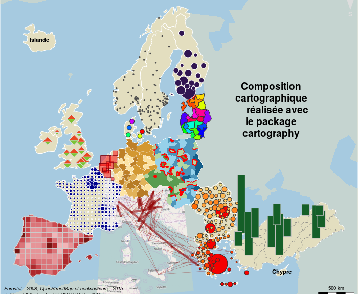
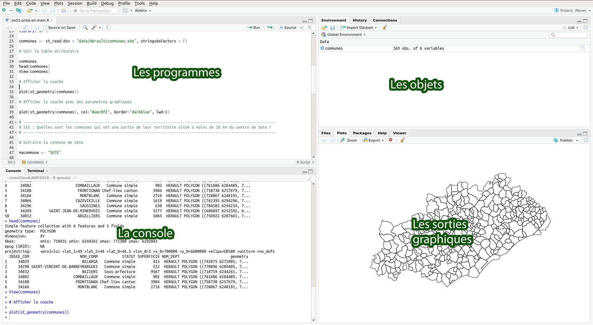
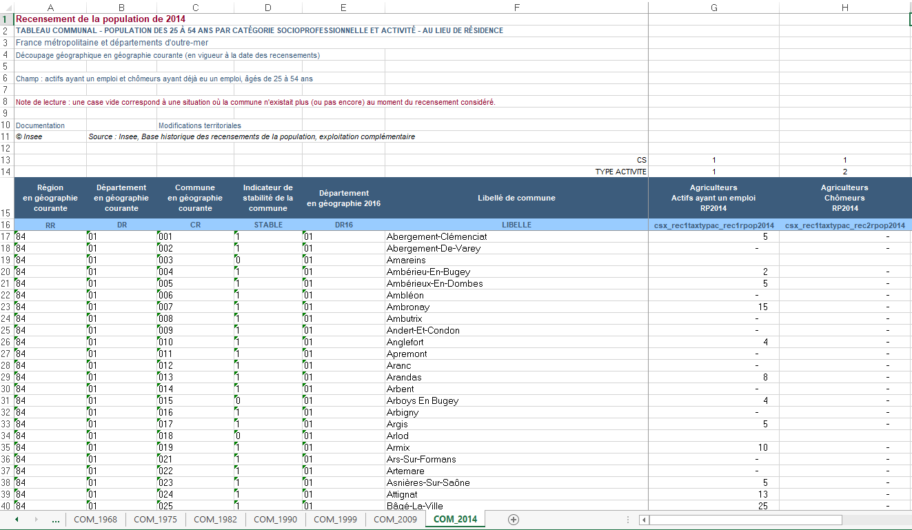
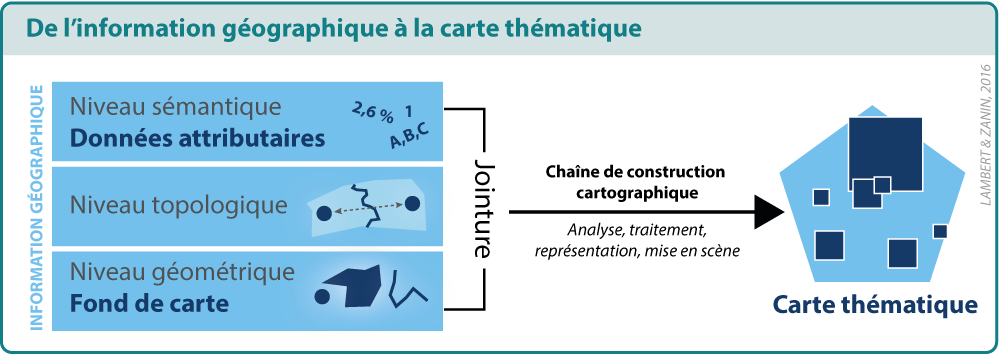
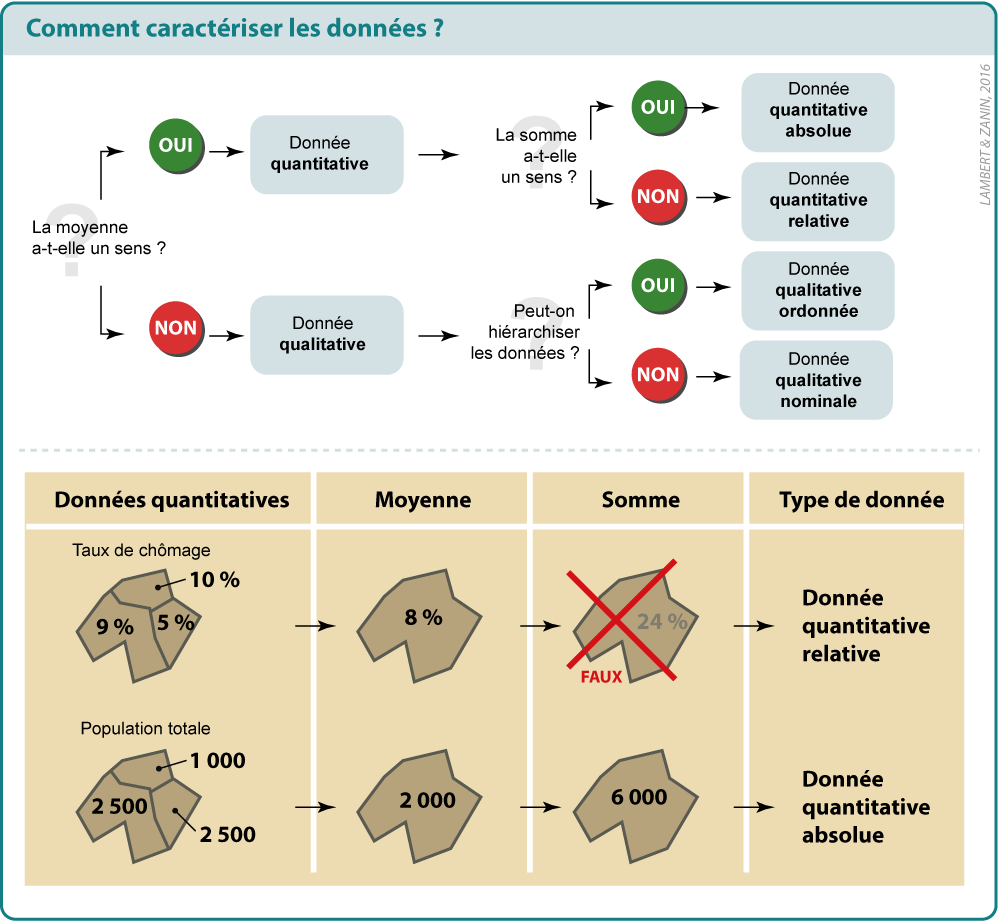
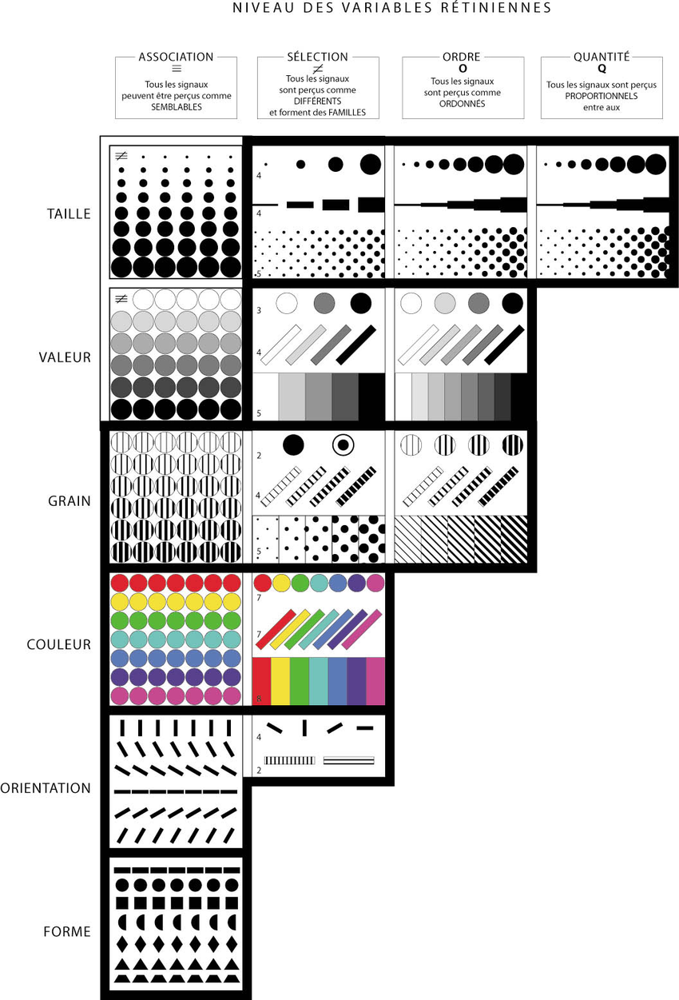
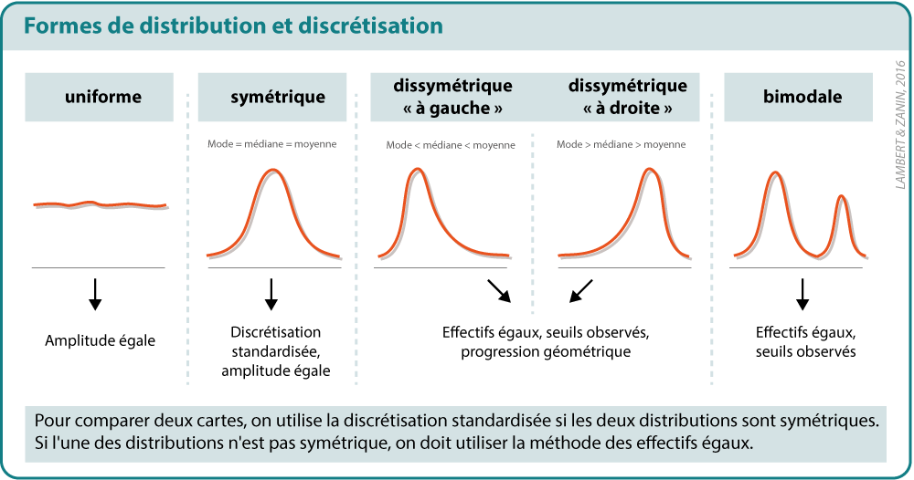
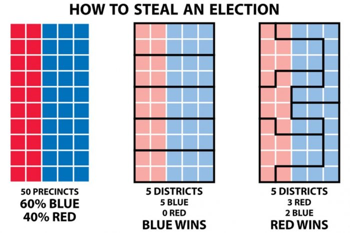
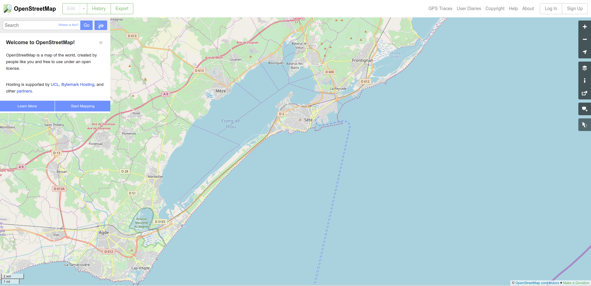
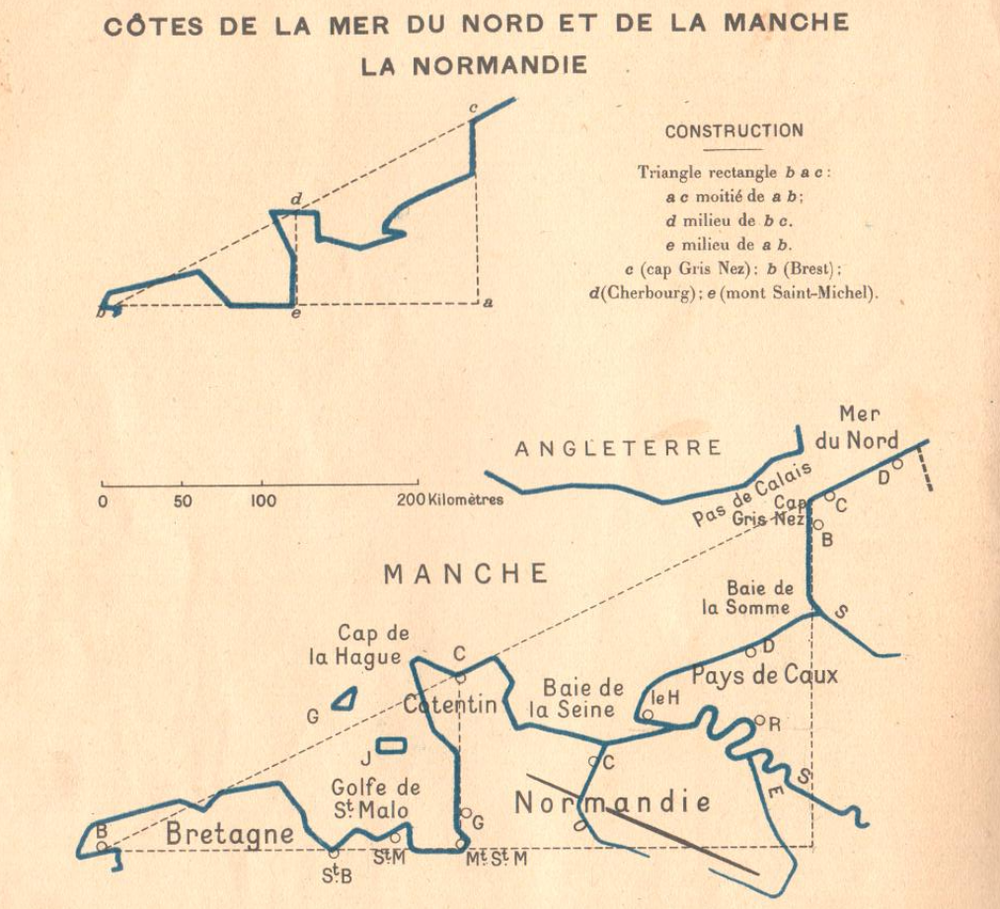

<link rel="stylesheet" type="text/css" media="all" href="pics/mateshs.css" />

<h3>
Cette <b>formation de 3 heures 30</b> porte sur la visualisation de données géographiques sous R. Y sont abordées 
les traitements SIG de base, la cartographie thématique (cartes en figurés proportionnels, cartes
choroplèthes, cartes de typologie, etc) et des cartes reposant sur des techniques plus avancées comme les cartes 
sur grille ou les cartes de discontinuités.

</img>

Sont ici principalement utilisés les packages <b>sf</b> (manipulation de données spatiales) et <b>cartography</b> (cartographie
thématique). Chaque exemple propose une chaîne de traitements depuis le chargement des données, leur mise en forme,
jusqu'à la mobilisation de méthodes adaptées permettant de répondre à des questions spatiales. 

Les exemples proposés sont réalisés à différentes échelles, du local (région Occitanie) au Monde, en passant par l'Europe. 

</h3>

# Pourquoi faire de la cartographie avec R ?

*"La science est infaillible, mais les savants se trompent toujours."* (Anatole France, 1889). Ce principe peut également être appliqué à la cartographie. En effet, toute carte est issue d'un processus complexe de choix, de selections, d'opérations statistiques ou géomatiques. Certains auteurs énoncent que les cartes sont subjectives (Brunet). D'autres auteurs disent carrément que les cartes mentent (Monmonnier). Quoi qu'il en soit, toute carte résulte de l'acte créateur des choix de son auteur. Lorsque l'on se situe dans une démarche scientifique, ces choix doivent être traçables, partageables et soumis à la discussion scientifique (ce qui est difficilement faisable quand ces cartes sont réalisées dans un environnement "clic-bouton"). 

La réalisation des cartes dans le langage R permet de tracer toutes les opérations nécessaires à une réalisation cartographique de qualité. Réaliser des cartes dans ce langage unique permet, en diffusant le code source en même temps que les cartes, de jouer "cartes sur table". Cela permet de détailler les choix qui ont été faits et s'exposer à la controverse scientifique.  Cela permet aussi de travailler à plusieurs sur une carte, en associant des compétences complémentaires (sémiologie graphique, statistique, géomatique, etc.) et de faciliter la mise à jour de documents déjà rélisés (en rééxecutant un code préalablement réalisé, par exemple).

Au final, l’utilisation de R nécessite un effort non négligeable pour ceux qui ne sont pas habitués à l’univers de la programmation informatique. Mais définitivement, l’investissement n'a que des avantages.

# Packages & données

## Environnement de travail

Pour exécuter les programmes proposés par la formation, [installez / mettez à jour R](https://www.r-project.org/){target="_blank"} (version 3.4.4 minimum), [R Studio](https://www.rstudio.com/){target="_blank"}. Lancez ensuite R studio et installez les packages au moyen des commandes suivantes (prévoir au moins 10 minutes). 

</img>

## Les packages

Installation des packages utilisés pendant la formation. Ouvrez R-Studio et tapez :

```{r eval = FALSE}
install.packages("sf")
install.packages("cartography")
install.packages("cartogram")
install.packages("readxl")
install.packages("countrycode")
```

Optionnel

```{r eval = FALSE}
install.packages("rmapshaper")
install.packages("osmdata")
install.packages("reshape2")
install.packages("eurostat")
install.packages("rnaturalearth")
```

Version des packages utilisés dans ce document

```{r eval = TRUE, echo=FALSE}
pkgs <- c("sf", "cartography", "countrycode", "readxl", "rnaturalearth",  "cartogram", "reshape2", "eurostat", "rmapshaper", "osmdata")


str <- ""
for (i in 1:length(pkgs)){
  str <- paste0(str,pkgs[i]," (version ",packageVersion(pkgs[i]),")", ", ")
  
}
str <- substr(str,1,nchar(str)-2)
str
```


### Packages dédiés à visualisation de données géographiques

* Le package **cartography** permet de créer et intégrer des cartes thématiques dans sa chaîne de traitements en R. Il permet des représentations cartographiques tels que les cartes en symboles proportionnels, des cartes choroplèthes, des typologies, des cartes de flux ou des cartes de discontinuités. Il offre également des fonctions qui permettent d'améliorer la réalisation de la carte, comme des palettes de couleur, des éléments d'habillage (échelle, flèche du nord, titre, légende...), d'y rattacher des labels ou d'accéder à des APIs cartographiques. 
* Le package **cartogram** comme son nom l'indique permet de construire des cartogrames continus ou discontinus.

### Packages dédiés à la manipulation de données (spatiales ou non)

* Le package **sf** est un package qui permet d'importer, gérer et transformer des données géographiques (gestion des projections, opérations SIG).
* Le package **readxl** permet d'importer des fichiers Excel sous R. 
* Le package **reshape2** permet de transformer et mettre en forme des données sous R.
* Le package **rmapshaper** permet de généraliser le contours d'un fond de carte

### Packages fournisseurs de données

* Le package **eurostat** permet d'importer des données d'Eurostat, fournisseur de référence pour les territoires européens. 
* Le package **rnaturalearth** permet d'importer les fonds de carte vectoriels de référence pour le Monde (niveaux
État ou infra-nationaux) ainsi que des éléments d'habillage (graticules, traits de côte, etc.)
* Le package **osmdata** permet d'importer des données d'OpenStreetMap.


# Exo 1 - Bienvenue à Sète

## Objectifs
* Espace d'étude : Hérault, communes
* Prise en main des fonctions spatiales de R

## Téléchargement des données

Téléchargez les données ici : [Télécharger](https://github.com/riatelab/anfdataviz/blob/master/exercice1.zip){target="_blank"}

Décompressez le dossier et cliquez sur **proj.Rproj**. Le fichier **exo1.R** s'ouvre dans R-Studio.

## Commandes de base

Vérifiez votre répertoire de travail courant.

```{r, eval=F}
getwd()
```

Consulter le contenu. 
Regarder ce qu'il y a dans le répertoire "data" 

```{r, eval=F}
list.files()
list.files("data")
```

Import d'une couche SIG dans R avec le package sf. Pacakge basé sur GEOS 
(Geometry Engine Open Source) et GDAL (Geospatial Data Abstraction Library). 

```{r, eval=T}
library("sf")
communes <- st_read(dsn = "data/communes.shp", stringsAsFactors = F)
```

Voir la table atributaire

```{r, eval=T}
communes
head(communes,3)
View(communes)
```

L'instruction plot permet d'afficher la couche.
L'instruction st_geometry permet d'accéder à la variable définissant les géométries. 

```{r, eval=T}
par(mar = c(0.5,0.5,1.5,0.5)) 
plot(st_geometry(communes))
```

Afficher la couche avec des parametres graphiques
```{r, eval=T}
par(mar = c(0.5,0.5,1.5,0.5)) 
plot(st_geometry(communes), col="#aec8f2", border="darkblue", lwd=1)
```


Ajuster les marges
```{r, eval=T}
par(mar = c(0.5,0.5,1.5,0.5)) 
plot(st_geometry(communes), col="#aec8f2", border="darkblue", lwd=1)
```

## Introduction au SIG avec R / Manipuler les informations spatiales

Nous cherchons à identifier les communes qui ont une partie de leur territoire 
situé à moins de 20 km du centre de Sète.


Nous commençons par extraire la commune de Sète du fond de carte communal de référence.   

```{r, eval=T}
macommune <- "SETE"
monpoly <- communes[communes$NOM_COMM == macommune,]
par(mar = c(0.5,0.5,1.5,0.5)) 
plot(st_geometry(communes), col="#aec8f2", border="darkblue", lwd=1)
plot(st_geometry(monpoly), col="red", border="purple", lwd=1, add=T)
```

Calculer le centroïde de la commune de Sète. 

```{r, eval=T}
moncentre <- st_centroid(x = monpoly)
par(mar = c(0.5,0.5,1.5,0.5)) 
plot(st_geometry(communes), col="#aec8f2", border="darkblue", lwd=1)
plot(st_geometry(monpoly), col="red", border="purple", lwd=1, add=T)
plot(st_geometry(moncentre), pch=20, col="black", cex=2, add=T)
```

Calculer une zone tampon


```{r, eval=T}
mydist <- 20000
buff <- st_buffer(x = st_geometry(moncentre), dist=mydist)
par(mar = c(0.5,0.5,1.5,0.5)) 
plot(st_geometry(communes), col="#aec8f2", border="darkblue", lwd=1)
plot(st_geometry(monpoly), col="red", border="purple", lwd=1, add=T)
plot(st_geometry(moncentre), pch=20, col="black", cex=2, add=T)
plot(buff, col=NA, border="black", lty=2,add=T)
```

Récupérer la liste des communes

```{r, eval=T}
communes$buff <- st_intersects(st_geometry(communes), st_geometry(buff), sparse = FALSE)
head(communes)
```

Récupérer le nombre de communes situées à moins de 20 km de Sète. 

```{r, eval=T}
nb <- dim(communes[communes$buff == T,])
nb[1]
```

Extraction et affichage des communes

```{r, eval=T}
communes20km <- communes[communes$buff == TRUE,]
par(mar = c(0.5,0.5,1.5,0.5)) 
plot(st_geometry(communes), col="#aec8f2", border="darkblue", lwd=1)
plot(st_geometry(monpoly), col="red", border="purple", lwd=1, add=T)
plot(st_geometry(moncentre), pch=20, col="black", cex=2, add=T)
plot(buff, col=NA, border="black", lty=2,add=T)
plot(st_geometry(communes20km), col=NA, lwd=2, border="red", add=T)
```


Nouvelle carte avec un titre
(NB : La première couche affichée détermine l'emprise de la carte)

```{r, eval=T}
par(mar = c(0.5,0.5,1.5,0.5)) 
plot(st_geometry(communes20km), col="#aec8f2", border="darkblue", lwd=1)
plot(st_geometry(monpoly), col="red", border="purple", lwd=1, add=T)
plot(buff, col=NA, border="black", lty=2,add=T)
montitre <- paste0("Il y a ", nb[1], " communes situées à moins de ", mydist/1000, "km de ",tolower(macommune))
title(montitre)
```

Export (si besoin)

```{r, eval=F, echo=T}
st_write(obj = communes20km, dsn = "outputs/resultat.shp")
```


## A vous de jouer ! 
Reproduisez cette procédure avec la commune et la distance de votre choix.

Pour accéder au listing des communes d'Hérault
```{r, eval=F}
communes$NOM_COMM
```


# Exo 2 - Cartographier l'Occitanie

## Objectifs
* Thématique : Réaliser une carte des catégories socio-professionnelles.
* Espace d'étude : Occitanie, communes
* Visualisation associée : carte en figurés proportionnels (+ cartogrammes de Dorling)
* packages utilisés : sf, cartography, cartogram, readxl 

## Téléchargement des données

Téléchargez les données ici : [Télécharger](https://github.com/riatelab/anfdataviz/blob/master/exercice2.zip){target="_blank"}

Décompressez le dossier et cliquez sur **proj.Rproj**. Le fichier **exo2.R** s'ouvre dans R-Studio.

## Préparation des données
Pour bien commencer, il est fondamental de jeter un oeil au fichier d'entrée
pour comprendre son organisation et savoir comment l'importer sous R. 

Ouvrez le fichier data/INSEE/pop-act2554-csp-cd-6814.xls
Nous nous intéressons ici à l'onglet "COM_2014".

</img>

```{r}
library("sf")
library("readxl")
```

Importez correctement cette feuille du tableau Excel dans R. 
Les commandes de base ci-dessous permettent de visualiser le nom des colonnes,
de filtrer le contenu de la table (par région) et de visualiser finalement
le tableau de données dans R. 

```{r}
sheet <- "COM_2014"
data <- data.frame(read_excel("data/INSEE/pop-act2554-csp-cd-6814.xlsx", skip = 15, sheet = sheet)) 
colnames(data)
data <- data[data$RR == "76",] # Ne prendre que les communes d'Occitanie (code 76)
View(data) # vOIR Si le fichier a correctement été importé. 
```

Pour notre analyse nous avons besoin de regrouper plusieurs colonnes. Créez
de nouveaux champs en aggrégeant emploi + chômage par CSP. 
Renommez ces champs de façon explicite. Cela facilitera leur traitement par la 
suite. 
Agrégez également le code départemental au code communal afin de créer un
identifiant (id) compatible avec le fond de carte IGN. 

```{r}
data$id <- paste0(data$DR, data$CR) # Creation du code commune
data[,"agr"]<- round(data[7] + data[8],0) # Actifs + chomeurs par CSP
data[,"art"] <- round(data[9] + data[10],0)
data[,"sup"] <- round(data[11] + data[12],0)
data[,"int"] <- round(data[13] + data[14],0)
data[,"emp"] <- round(data[15] + data[16],0)
data[,"ouv"] <- round(data[17] + data[18],0)
data[,"ouv_chom"] <- round(data[18],0)
data$total <- data$agr + data$art + data$sup + data$int + data$emp + data$ouv
```

Importez et visualisez le fond de carte (extrait IGN Geofla communes).

```{r}
communes <- st_read(dsn = "data/IGN/occitanie.shp", stringsAsFactors = F)
par(mar = c(0.5,0.5,1.5,0.5)) 
plot(st_geometry(communes),col="white", border="black", lwd=0.1)
```

La **Jointure** est une étape cruciale qui permet de lier un fond de carte
avec des données par un même identifiant. Il faut que les identifiants entre
ces deux ressources soient exactement les mêmes. 

</img>

Réalisez la jointure entre données et fond de carte avec l'instruction *merge*. 
Cela présuppose en amont que les identifiants géographiques entre ces deux 
ressources sont les mêmes (ça tombe bien, c'est le cas !). Identifiez bien
le nom des champs sur lesquel doit porter la jointure. 

```{r}
communes <- merge(x = communes, y = data, by.x = "INSEE_COM", by.y = "id", all.x=T)
```

Pour finir, nettoyez le tableau. On ne garde que les colonnes utiles pour la suite...
```{r}
colnames(communes)
fields <- c("INSEE_COM", "LIBELLE", "agr", "art", "sup", "int", "emp", "ouv","ouv_chom", "total",  "geometry")
communes <- communes[,fields]
colnames(communes) <-  c("id", "name", "agr", "art", "sup", "int", "emp", "ouv","ouv_chom", "total",  "geometry")
head(communes)
```

## Le package cartography

### Le package et sa documentation

Chargez le package *cartography*. 

```{r}
library("cartography")
```

Ce package permet de créer et intégrer des cartes thématiques dans sa chaîne de 
traitement en R. Il permet des représentations cartographiques telles que les cartes
en symboles proportionnels, des cartes choroplèthes, des typologies, des cartes de
flux ou des cartes de discontinuités. Il offre également des fonctions qui permettent
d'améliorer la réalisation de la carte, comme des palettes de couleur, des éléments
d'habillage (échelle, flèche du nord, titre, légende...), d'y rattacher des labels
ou d'accéder à des APIs cartographiques.

Pour utiliser aisément ce package, plusieurs sources d'intérêts peuvent être consultées :

* La documentation du package qui documente toutes les fonctions du package,
accessible directement dans R Studio. Pour cela, vous pouvez taper simplement :

```{r}
?cartography
```

* La [cheat sheet](http://riatelab.github.io/cartography/vignettes/cheatsheet/cartography_cheatsheet.pdf){target="_blank"}
de cartography, qui résume les principales fonctions du package de façon synthétique. 
* La vignette associée au package, qui présente des réalisations issues de ce
package, elle aussi accessible directement dans R studio.
* La vignette [Faire des cartes - Introduction au package sf](https://github.com/riatelab/intro_sf){target="_blank"}
qui présente les packages *sf* et *cartography*, à partir d'un cas d'utilisation
centré sur Mexico. 
* Le blog [R Géomatique](https://rgeomatic.hypotheses.org/){target="_blank"}, maintenu par
l'auteur de *cartography* qui met à disposition ressources et exemples d'intérêt 
liés au package et à la représentation d'information spatiale
sous R. 

### Éléments théoriques

Savoir représenter correctement de l'information dans des cartes thématiques,
c'est d'abord savoir caractériser la nature statistique des données. 

</img>

Jacques Bertin a notamment théorisé dans son ouvrage de référence "Sémiogie Graphique" (1967)
les méthodes visuelles qui permettent de retranscrire efficacement une information
statistique sous forme cartographique. 

Il identifie des variables visuelles (ou rétiniennes) dont l'utilisation dépend
de l'implantation (point, ligne, surface) et la nature statistique de l'information à représenter
(association, sélection, ordre, quantité).

</img>


## Visualisation : carte en figurés proportionnels 

Pour les caractères quantitatifs absolus la variable visuelle adaptée est la taille
afin de préserver graphiquement les rapports de proportionnalité existant entre
les différentes valeurs du tableau de données. Il n'est pas nécessaire de discrétiser
les valeurs (cf exemple sur l'Europe). 


### Visualisation ! 

Cartographiez le nombre d'actifs par commune grâce à la fonction *propSymbolsLayer*

```{r}
# Ajuster les marges
par(mar = c(0.5,0.5,1.5,0.5)) 

# Cartographie
plot(st_geometry(communes), col="lightblue",border="white", lwd=0.2) # Fond de carte de la région Occitanie
propSymbolsLayer(x = communes, var = "total",  # Carte en figurés proportionnels 
                 symbols = "circle", col =  "red",
                 legend.pos = "right", border = "grey",
                 legend.title.txt = "Les actifs",
                 legend.style = "c")

top <- sort(data.frame(communes)[,"total"], decreasing = TRUE) 
labelLayer(x = communes[data.frame(communes)[,"total"] %in% top[1:15],], txt = "name", halo=TRUE, cex = 0.6, col= "#000000", bg = "#FFFFFF50", overlap = FALSE) # Nommer les 15 premières villes d'Occitanie en nombre d'actifs
title("Région Occitanie")
```


## Visualisation : carte combinant figurés proportionnels et typologie

Il est possible d'associer à ces figurés proportionnels la représentation
d'un caractère qualitatif de différenciation. 

La variable visuelle adaptée pour ce type de données est la couleur différentielle. 

Exécutez le code ci-dessous, qui propose le calcul d'une typologie sur la 
surreprésentation d'ouvriers ou de cadres. Cette typologie peut être représentée
simplement avec la fonction *typoLayer*. 

Pour le choix des couleurs, vous pouvez utiliser *color picker* pour obtenir les
couleurs que vous désirez, au format hexadécimal présenté ci-dessous. 

```{r}
# Typologie (plus d'ouvriers que de cadres ?)
communes$typo <- "Indéterminé"
communes$r <- communes$ouv / communes$sup
communes$r[is.na(communes$r)] <- 0
communes[communes$r > 1.1,"typo"] <- "Plus d'ouvriers que de cadres"
communes[communes$r < 0.91,"typo"] <- "Plus de cadres que d'ouvriers"

# Choix des couleurs
colouv <- "#dd4e44" # tonalité rouge
colsup <- "#63b269" # tonalité verte

# Ajuster les marges
par(mar = c(0.5,0.5,1.5,0.5)) 

# Cartographie
typoLayer(communes, var="typo", 
          legend.values.order = c("Plus d'ouvriers que de cadres", 
                                  "Plus de cadres que d'ouvriers",
                                  "Indéterminé" ),
          col = c(colouv, colsup, 'grey'), 
          border = NA, legend.title.txt = "Type dominant") 
```

On peut aussi décider d'associer cette représentation à la carte précédente
en figurés proportionnels, grâce à la fonction *propSymbolsTypoLayer* :  

```{r}
# Ajuster les marges
par(mar = c(0.5,0.5,1.5,0.5)) 

# Combiner avec la carte précédente
plot(st_geometry(communes), col="lightblue",border=NA)
propSymbolsTypoLayer(x = communes, var = "total", var2 = "typo",
                     symbols = "circle",
                     inches = 0.4,
                     col = c(colouv, colsup, 'grey'),
                     border = "white", lwd = 0.1,
                     legend.var2.values.order = c("Plus d'ouvriers que de cadres", 
                                             "Plus de cadres que d'ouvriers",
                                             "Indéterminé" ),
                     legend.var.pos = "right", 
                     legend.var.title.txt = "Nombre d'actifs",
                     legend.var2.title.txt = "Type dominant")

labelLayer(x = communes[data.frame(communes)[,"total"] %in% top[1:15],], txt = "name", halo=TRUE, cex = 0.6, col= "#000000", bg = "#FFFFFF50", overlap = FALSE) 
title("Cadres et ouvriers en région Occitanie")
```


## Une astuce cartographique : le "cartogramme" de Dorling

A cette échelle géographique on remarque que les cercles se superposent les uns
sur les autres. Cela ne nuit pas à la compréhension globale de l'organisation spatiale
du phénomène, mais ne permet pas d'en avoir une lecture précise (à cette échelle de visualisation et pour 
cet espace d'étude). On peut aussi décider d'utiliser un package et une fonction qui permet d'éviter cela. 

Pour ce faire, lancez la librairie *cartogram* et la fonction *cartogram_dorling*. Le cartogramme de Dorling
replace la localisation des cercles en conservant leurs positions relatives et permet d'éviter leurs chevauchements. 


```{r}
library("cartogram")
```

```{r}
# Ajuster les marges
par(mar = c(0.5,0.5,1.5,0.5)) 

# cartogram de Dorling
actifs <- cartogram_dorling(communes, "total", k = 1, m_weight = 1, itermax = 20)

plot(st_geometry(communes), col="lightblue",border=NA)

typoLayer(actifs, var="typo", 
          legend.values.order = c("Plus d'ouvriers que de cadres", 
                                  "Plus de cadres que d'ouvriers",
                                  "Indéterminé" ),
          col = c(colouv, colsup, 'grey'), 
          border = "white", lwd=0.2, legend.title.txt = "Type dominant",
          add = T) 
labelLayer(x = actifs[data.frame(actifs)[,"total"] %in% top[1:15],], txt = "name", halo=TRUE, cex = 0.6, col= "#000000", bg = "#FFFFFF50", overlap = FALSE) 
title("Ouvriers et cadres en Occitanie, 2014")
```

## A vous de jouer ! 

On souhaite réaliser une carte avec une autre catégorie socio-professionnelle : les agriculteurs (ou une autre CSP de votre choix). 
Pourquoi ne pas choisir des carrés à la place des cercles ? 

Voici le code à compléter pour réaliser la carte : 

```{r, eval=F}
plot(st_geometry(communes), col="",border="", lwd="")

propSymbolsLayer(...)
```


# Exo 3 - Cartographier l'Europe

## Objectifs
* Thématique : Réaliser des cartes de densité de population et de PIB par 
habitant pour les régions européennes. 
* Espace d'étude : Europe, NUTS3
* Visualisation associée : cartes choroplèthes et cartes en grilles
* packages utilisés : sf, cartography, eurostat, reshape2

## Téléchargement des données

Téléchargez les données ici : [Télécharger](https://github.com/riatelab/anfdataviz/blob/master/exercice3.zip){target="_blank"}

Décompressez le dossier et cliquez sur **proj.Rproj**. Le fichier **exo3.R** s'ouvre dans R-Studio.

## Préparation des données

Chargez les géométries qui seront utilisées pour visualiser vos résultats.
Il s'agit des géométries de référence des territoires européens adaptées à 
la cartographie thématique et proposées par [l'UMS RIATE](https://github.com/riatelab/nuts). 

```{r, eval=T}
# Charger la librairie sf
library(sf)

# Fond de carte principal
regions <- st_read(dsn = "data/GREAT/nuts2013-level3.shp", stringsAsFactors = F) 

# Couche d'habillage
countries <- st_read("data/GREAT/world.shp",stringsAsFactors = F)
```


**Astuce !** Le package *eurostat* permet d'accéder à la base de données de référence européenne directement dans l'environnement de R. Cela permet d'avoir des données à jour et d'éviter des potentielles erreurs de manipulation de 
données. 

Le code ci-dessous (**à ne pas exécuter**) est un exemple de procédure 
d'extraction de données (population, surface, PIB). 


```{r, eval=F}
library("eurostat")
library("reshape2") 

# POPULATION
var <- "demo_r_pjangrp3" # Table Eurostat d'intérêt
data <- get_eurostat(var, time_format = "num") # Telecharger la table ESTAT
data <- subset(data, data$sex == "T") # Filtre des dimensions du tibble
data <- subset(data, data$age == "TOTAL") # Filtre des dimensions du tibble
data <- dcast(data, geo ~ time, value.var = "values") # Transformation en dataframe des dimensions restantes
colnames(data) <- c("geo","POP_2014","POP_2015","POP_2016","POP_2017") # Renommer les colonnes du dataframe de façon explicite

# SURFACE
var <- "reg_area3"
area <- get_eurostat(var, time_format = "num") # Telecharger la table ESTAT
area <- subset(area, area$landuse == "TOTAL") # Filtre des dimensions de la table
area <- dcast(area, geo ~ time, value.var = "values")
colnames(area) <- c("geo","AREA")

# PIB
var <- "nama_10r_3gdp"
gdp <- get_eurostat(var, time_format = "num")
gdp <- subset(gdp, gdp$unit == "MIO_EUR")
gdp <- dcast(gdp, geo ~ time, value.var = "values")
fields <- c("geo", "2014", "2015", "2016") # On ne garde que les valeurs de PIB correspondant aux valeurs de population disoponibles
gdp <- gdp[,fields]
colnames(gdp) <- c("geo","GDP_2014","GDP_2015","GDP_2016")

# Jointure avec les géométries
regions <- merge(x = regions, y = data, by.x = "id", by.y = "geo", all.x=T) # population
regions <- merge(x = regions, y = area, by.x = "id", by.y = "geo", all.x=T) # surface
regions <- merge(x = regions, y = gdp, by.x = "id", by.y = "geo", all.x=T) # surface

# Export du fichier contenant géométries et données
write_sf(obj = regions, dsn = "data/regions_data.shp")
```

Importez le jeu de données créé suite à cette étape de collecte de données,
qui est maintenant associé aux géométries européennes de réference. 

```{r, eval=T}
regions <- st_read("data/regions_data.shp", stringsAsFactors = F)
par(mar = c(0.5,0.5,1.5,0.5)) 
plot(st_geometry(regions))
head(regions)
```

Pour choisir l'année de référence sur laquelle portera la visualisation, regardez
le nombre de valeurs manquantes...

```{r, eval=T}
apply(regions,2,function(x) sum(is.na(x)))
```

... Et calculez le ratio sur lequel va porter la visualisation. 

```{r, eval=T}
regions$DENS_2017 <- regions$POP_2017 / regions$AREA
```

Tout est prêt pour la visualisation !

## Visualisation : cartes choroplèthes

La variable visuelle adaptée pour représenter des données quantitatives relatives
est la couleur ordonnée (ou niveaux de gris). Le traitement de ce type de données
implique au prélable de définir **le nombre de classes**, une 
**méthode de discrétisation** et **une palette de couleurs** sur laquelle portera la représentation. 

La discrétisation consiste à découper une série statistique en classes de valeurs.
Il n'existe pas de méthode optimum. Chaque méthode donnera une carte différente,
plus ou moins conforme à la distribution de départ. L'agrégation de données en 
classes introduit de fait une erreur ou une distorsion dans la perception de cette
distribution. Le choix d'une méthode de discrétisation dépend donc des propriétés
de la distribution mais aussi des objectifs cartographiques que l'on s'est fixés. 

</img>


### Étape 1 : Déterminer la forme de la distribution
Quelle est la forme de la distribution de la variable de densité de population
2017 ?

```{r, eval=T}
var <- regions$DENS_2017

hist(var, probability = TRUE, nclass = 30)
rug(var)
moy <- mean(var)
med <- median(var)
abline(v = moy, na.rm = T, col = "red", lwd = 3)
abline(v = med, na.rm = T, col = "blue", lwd = 3)

summary(regions$DENS_2017)
```

On constate qu'il y a beaucoup de régions à faible densité et très peu
de région à forte densité; la série est donc fortement dyssimétrique "à gauche".

On choisit alors la méthode des quantiles qui permet de préserver la dissymétrie des valeurs. 

*NB / Dans cartography, plusieurs méthodes de discrétisation sont proposées. Jetez un
oeil à la documentation de la fonction getBreaks pour en savoir plus.* 


### Étape 2 : Combien de classes ? 

Le nombre de classes dépend du nombre d'unités spatiales prises en compte 
(plus il y a d'unités spatiales plus on peut faire de classes) et dépend
des capacités de perception de l'oeil humain (distinguer 10 nuances de
couleur est un grand maximum). 

On souhaite mettre en évidence les 10 % des valeurs les plus élevées (régions
métropolitaines) et les 10 % des valeurs les plus faibles. Autrement dit, 
on choisit **10 classes** pour découper notre série statistique (déciles). 


### Étape 3 : Quelles couleurs ? 
Explorez la documentation de la fonction carto.pal de cartography pour choisir votre palette.
Utilisez l'instruction display.carto.all pour visualiser les palettes disponibles. 
Nous choisissons ici la palette "red.pal"

```{r, eval=T}
# Choix de la palette
display.carto.all(10)
cols <- carto.pal(pal1 = "red.pal", n1 = 10)
```

Tout est défini pour lancer la cartographie ! 


### Visualisation de la discrétisation choisie

```{r, eval=T}
library(cartography)

par(mfrow=c(1,1))

# Methode discretisation (quantiles)
breaks <- getBreaks(v = regions$DENS_2017, nclass = 10, method = "quantile")
hist(regions$DENS_2017, probability = TRUE, xlim = c(0,3000), breaks = breaks, col = cols,
     main = "Quantiles")
abline(v = median(regions$DENS_2017, na.rm = T), col = "blue", lwd = 3)

```


### Cartographie

On utilise la projection officielle pour l'Union Européenne

```{r, eval=T}
countries <- st_transform(countries,3035)
regions <- st_transform(regions,3035)
```

La carte choroplèthe est réalisée avec la fonction **choroLayer**. 

```{r, eval=T}

# Mise en page
par(mar = c(0.5,0.5,1.5,0.5)) # Ajuster les marges

plot(st_geometry(regions), col = NA, border = NA)
plot(st_geometry(countries), col = "#c6c4c4", border = NA, add =TRUE)

# Cartographie (ratio)
choroLayer(x = regions, 
           var = "DENS_2017",
           method ="quantile",
           nclass = 10,
           col = cols,
           border = NA,
           add = TRUE,
           legend.pos = "left",
           legend.title.txt = "Densité de population \n 2017 (hab/km²)",
           legend.values.rnd = 0)

plot(st_geometry(countries), col = NA, border = "#ffffff", lwd = 1, add =TRUE)

# Sources + elements d'habillage
layoutLayer(title = "Densité de population - Méthode des quantiles",
            author = "Serial Mappers, 2018", sources = "Eurostat, 2018",
            scale = 200, tabtitle = FALSE,
            frame = FALSE,theme = "red.pal",
            south = TRUE)
```


Si on avait choisi une autre méthode de discrétisation le résultat aurait été tout 
autre ! 

```{r, eval=T, echo=F}
# Mise en page
par(mar = c(0.5,0.5,1.5,0.5)) # Ajuster les marges
par(mfrow=c(2,2)) # 2 cartes par ligne et par colonne

#----------------------
# Carte 1 - quantiles
#----------------------

# Affichage de la couche pays sur l'emprise de l'Europe
plot(st_geometry(regions), col = NA, border = NA)
plot(st_geometry(countries), col = "#c6c4c4", border = NA, add =TRUE)

# Cartographie (ratio)
choroLayer(x = regions, 
           var = "DENS_2017",
           method ="quantile",
           nclass = 10,
           col = cols,
           border = NA,
           legend.pos = "topleft",
           legend.title.txt = "Densité de population \n 2017 (hab/km²)",
           legend.values.rnd = 0,
           add=T)

# Sources + elements d'habillage
layoutLayer(title = "Densité de population - Méthode des quantiles",
            author = "Serial Mappers, 2018", sources = "Eurostat, 2018",
            scale = 200, tabtitle = FALSE,
            frame = FALSE,theme = "red.pal",
            south = TRUE)


#-------------------------------
# Carte 2 - intervalles égaux
#-------------------------------

# Affichage de la couche pays sur l'emprise de l'Europe
plot(st_geometry(regions), col = NA, border = NA)
plot(st_geometry(countries), col = "#c6c4c4", border = NA, add =TRUE)

# Cartographie (ratio)
choroLayer(x = regions, 
           var = "DENS_2017",
           method ="equal",
           nclass = 10,
           add=T,
           col = cols,
           border = NA,
           legend.pos = "topleft",
           legend.title.txt = "Densité de population \n 2017 (hab/km²)",
           legend.values.rnd = 0)

# Sources + elements d'habillage
layoutLayer(title = "Densité de population - Méthode des intervalles égaux",
            author = "Serial Mappers, 2018", sources = "Eurostat, 2018",
            scale = 200, tabtitle = FALSE,
            frame = FALSE,theme = "red.pal",
            south = TRUE)

#--------------------------------
# Carte 3 - Moyenne écart-type
#--------------------------------

# Récupérer les seuils
breaks <- getBreaks(v = regions$DENS_2017, k = 1.8, method = "msd", middle = FALSE)

# Affichage de la couche pays sur l'emprise de l'Europe
plot(st_geometry(regions), col = NA, border = NA)
plot(st_geometry(countries), col = "#c6c4c4", border = NA, add =TRUE)

# Cartographie (ratio)
choroLayer(x = regions, 
           var = "DENS_2017",
           breaks = breaks,
           nclass = 10,
           col = cols,
           add = T,
           border = NA,
           legend.pos = "topleft",
           legend.title.txt = "Densité de population \n 2017 (hab/km²)",
           legend.values.rnd = 0)

# Sources + elements d'habillage
layoutLayer(title = "Densité de population - Méthode Moyenne / écart-type",
            author = "Serial Mappers, 2018", sources = "Eurostat, 2018",
            scale = 200, tabtitle = FALSE,
            frame = FALSE,theme = "red.pal",
            south = TRUE)


#--------------------------------------
# Carte 4 - Progression géométrique
#--------------------------------------  

# Affichage de la couche pays sur l'emprise de l'Europe
plot(st_geometry(regions), col = NA, border = NA)
plot(st_geometry(countries), col = "#c6c4c4", border = NA, add =TRUE)

# Cartographie (ratio)
choroLayer(x = regions, 
           var = "DENS_2017",
           method ="geom",
           nclass = 10,
           col = cols,
           border = NA,
           add = T,
           legend.pos = "topleft",
           legend.title.txt = "Densité de population \n 2017 (hab/km²)",
           legend.values.rnd = 0)

# Sources + elements d'habillage
layoutLayer(title = "Densité de population - Méthode progression géométrique",
            author = "Serial Mappers, 2018", sources = "Eurostat, 2018",
            scale = 200, tabtitle = FALSE,
            frame = FALSE,theme = "red.pal",
            south = TRUE)

```

## A vous de jouer !

Créez une carte choroplèthe avec les paramètres suivants :
* Indicateur : PIB / habitant 2014
* Discrétisation : quantiles (8 classes)
* Palette de couleurs : Double palette (green.pal/red.pal)

Avant de passer à la cartographie, pensez à créer la variable
PIB par habitant. 

```{r, eval=F}
par(mfrow=c(1,1)) # On revient à un affichage pleine page
choroLayer(...)
```

## Visualisation : cartes carroyées

Sur les cartes précédentes on a pu constater que la taille des entités 
territoriales est très différente d'un pays à l'autre. Pour certains pays
(Allemagne, Pologne) les unités territoriales sont très petites et permettent de distinguer villes 
et périphéries. Dans d'autres cas, comme en France, celles-sont agrégées et 
rendent les résutats difficilement comparables. 

Ces difficultés liées aux hétérogénéités de maillage renvoient à une série 
de travaux connus sous l'acronyme **MAUP** (Modifiable Area Unit Problem)[(voir)](http://www.csiss.org/GISPopSci/workshops/2009/UCSB/readings/Openshaw-Taylor-1979.pdf){target="_blank"}, 
souvent illustré de la façon suivante : 

</img>

Plusieurs méthodes existent pour apporter des solutions à ces problèmes
en cartographie.

La méthode du carroyage, par exemple, consiste à découper l'espace géographique en un maillage
formé de carrés réguliers dans une projection donnée. La donnée est répartie sur
ce quadrillage régulier au prorata de la surface représentée. Le quadrillage permet ainsi
de s'affranchir des mailles administratives. 

</img>

Comment faire ? La fonction **getGridLayer** du package cartography permet de construire ces grilles 
régulières. Expolorez la documentation pour vous sensibiliser aux arguments 
de la fonction. 

La procédure est la suivante :

1. Définir le pas de grille (en mètres), son type et les variables qui seront transformées.
2. Pour les calculs de densité, convertir la surface en km². 
3. Pour les autres indicateurs, combiner les données de la façon suivante : ratio = stock1/stock2.
4. Choisir sa palette, son nombre de classes et sa méthode de discrétisation.
5. Représenter la grille avec la fonction choroLayer de cartography. 

```{r, eval=T}
# Transformation des donnees dans une grille reguliere de 50 km
mygrid50k <- getGridLayer(x = regions, cellsize = 50000 * 50000, 
                       type = "regular", var = c("POP_2017","POP_2014","GDP_2014"))

# Transformation des donnees dans une grille reguliere de 100 km
mygrid100k <- getGridLayer(x = regions, cellsize = 100000 * 100000, 
                          type = "regular", var = c("POP_2017","POP_2014","GDP_2014"))

# Conversion en km²
mygrid50k$densitykm <- mygrid50k$POP_2017 * 1000 * 1000 / mygrid50k$gridarea 
mygrid100k$densitykm <- mygrid100k$POP_2017 * 1000 * 1000 / mygrid100k$gridarea 


# Carte 1
par(mfrow=c(1,1))
par(mar = c(0.5,0.5,1.5,0.5)) # Ajuster les marges

cols <- carto.pal(pal1 = "blue.pal", pal2 = "red.pal",  n1 = 5, n2 = 5)  

plot(st_geometry(regions), col = NA, border = NA)
plot(st_geometry(countries), col = "#c6c4c4", border = NA, add =TRUE)

choroLayer(x = mygrid50k, var = "densitykm", 
           border = "grey80",col = cols, method ="quantile",
           nclass = 10, legend.pos = "topleft", legend.values.rnd = 1,
           lwd=0.5, add = T,
           legend.title.txt = "Densité de population, 2017")

layoutLayer(title = "Densité de population dans une grille régulière de 50km",
            author = "Serial Mappers, 2018", sources = "Eurostat, 2018",
            scale = 200,
            frame = TRUE,
            col = "red",
            coltitle = "white",
            south = TRUE)
# Carte 2

plot(st_geometry(regions), col = NA, border = NA)
plot(st_geometry(countries), col = "#c6c4c4", border = NA, add =TRUE)

choroLayer(x = mygrid100k, var = "densitykm", 
           border = "grey80",col = cols, method ="quantile",
           nclass = 10, legend.pos = "topleft", legend.values.rnd = 1,
           lwd=0.5, add = T,
           legend.title.txt = "Densité de population, 2017")

layoutLayer(title = "Densité de population dans une grille régulière de 100km",
            author = "Serial Mappers, 2018", sources = "Eurostat, 2018",
            scale = 200,
            frame = TRUE,
            col = "red",
            coltitle = "white",
            south = TRUE)
```

## Aller plus loin...

Remarque : D'autres méthodes existent pour résoudre les problèmes du MAUP, comme
les cartes lissées (ou de potentiel) qui consistent à
s'affranchir complètement du maillage administratif sous-jacent et qui se basent
sur la prise en compte du voisinage géographique selon une fonction mathématique 
(généralement gaussienne). 


```{r, eval=T}
par(mar = c(0.5,0.5,1.5,0.5)) # Ajuster les marges
regions$GDPM_2014 <- regions$GDP_2014 * 1000000
ratio <- regions$GDPM_2014 / regions$POP_2014
summary(ratio)


bks <- c(500, 5000, 10000, 15000, 20000, 26921, 30000, 35000, 40000, 428302)
cols <- c(rev(carto.pal("green.pal", 5)), carto.pal("orange.pal", 4))

plot(st_geometry(regions), border = NA, col = NA)
plot(st_geometry(countries), col = "#E3DEBF", border = NA, add = TRUE)

r <- regions[substr(regions$id,1,2) != "TR",]
r <- r[substr(r$id,1,2) != "IS",]
r <- r[substr(r$id,1,2) != "CH",]

smoothLayer(x = regions,
            var = 'GDPM_2014', var2 = 'POP_2014',
            span = 75000, beta = 2,
            resolution = 50000,
            legend.title.txt = "Potentiel de PIB par habitant, 2014\n(span = 75km)",
            col = cols, breaks = bks,
            lwd=0.2,
            mask = st_buffer(r,1),
            legend.pos = "topleft", legend.values.rnd = -2,
            add = T)

layoutLayer(title = "PIB par habitant, 2014", author = "Les serial mappers, 2018", 
            sources = "Source: Eurostat, 2018", frame = TRUE, scale = 500, north = FALSE, 
            theme = "sand.pal")
```


# Exo 4 - Cartographier le Monde

## Objectifs
* Thématique : Les inégalités d'IDH et/ou d'espérance de vie.
* Espace d'étude : Le Monde, pays.
* Visualisation associée : carte chorplèthe, discontinuités.
* packages utilisés : sf, cartography, rnaturalearth, readxl, countrycode.

</img>


## Téléchargement des données

Téléchargez les données ici : [Télécharger](https://github.com/riatelab/anfdataviz/blob/master/exercice4.zip){target="_blank"}

Décompressez le dossier et cliquez sur **proj.Rproj**. Le fichier **exo4.R** s'ouvre dans R-Studio.

## Préparation des données

### Import du fond de carte

méthode 1 : à la main (après téléchargement sur le site Natural Earth)

```{r, eval=F, echo=T}
library("sf")
countries <- st_read(dsn = "data/naturalearth/ne_110m_admin_0_countries.shp", stringsAsFactors = F)  
```

Méthode 2 : en ligne

```{r, eval=F, echo=T}
url <- "https://www.naturalearthdata.com/http//www.naturalearthdata.com/download/110m/cultural/ne_110m_admin_0_countries.zip"
download.file(url = url, destfile = "data/countries.zip")
unzip("data/countries.zip", exdir = "data", unzip = "internal")
file.remove("data/countries.zip")
countries <- st_read(dsn = "data/ne_110m_admin_0_countries.shp", stringsAsFactors = F)
```

Méthode 3 : directement via R

```{r, eval=T, echo=T}
library("rnaturalearth")
countries <- ne_countries(scale = 50, type = "countries", continent = NULL,
                          country = NULL, geounit = NULL, sovereignty = NULL,
                          returnclass = "sf")
```

Le fond de carte peut être visualisé avec l'instruction plot.

```{r, eval=T, echo=T}
par(mar = c(0.5,0.5,1.5,0.5))
plot(st_geometry(countries))
```

On ne conserve que les champs utiles. On les renomme. 

```{r, eval=T, echo=T}
countries <- countries[,c("adm0_a3", "admin", "geometry")]
colnames(countries) <- c("id","name","geometry")
```

On Supprime l'Antarctique.

```{r, eval=T, echo=T}
countries <- countries[countries$id != "ATA",]
```

On supprime les lignes vides.

```{r, eval=T, echo=T}
countries <- countries[!is.na(countries$id),]
```

```{r, eval=T, echo=T}
par(mar = c(0.5,0.5,1.5,0.5))
plot(st_geometry(countries))
```

### Import des données atributaires

Import des données sur l'éspérance de vie (source : Banque mondiale)

```{r, eval=T, echo=T}
library("readxl")
file <-"data/worldbank/API_SP.DYN.LE00.IN_DS2_en_excel_v2_10081535.xls"
sheet <- "Data"
lifexp <- data.frame(read_excel(file, skip = 3, sheet = sheet))
lifexp <- lifexp[,c("Country.Code","Country.Name","X2016")]
colnames(lifexp) <- c("id","name","lifexp2016")
lifexp$lifexp2016 <- as.numeric(as.character(lifexp$lifexp2016))
```

Import des données sur l'indice de developpement humain (source : Human Development Report)

```{r, eval=T, echo=T}
file <-"data/hdr/Human Development Index (HDI).csv"
hdi <- read.csv2(file = file, sep = ",",skip = 1)
hdi <- hdi[,c("Country","X2016")]
```

```{r, eval=T, echo=T}
head(hdi,4)
```

Le tableau de données sur l'IDH ne possède pas de codes géographiques, mais uniquement le nom des pays. Cela rend la jointure avec le fond de carte compliquée. Une solution : le package <b>countrycode</b>

```{r, eval=T, echo=T}
library("countrycode")
hdi$id <- countrycode(hdi$Country, 'country.name', 'iso3c')
```

Un peu de mise en forme. Les codes sont bien là. C'est presque magique... Mais attention, dans la pratique, une vérification manuelle s'impose. 

```{r, eval=T, echo=T}
hdi <- hdi[,c("id","Country","X2016")]
colnames(hdi) <- c("id","name","hdi2016")
hdi$hdi2016 <- as.numeric(as.character(hdi$hdi2016))  
head(hdi,4)
```

## Visualisation : carte choroplèthe

Chargement du package

```{r, eval=T, echo=T}
library("cartography")
```

Changer la projection du fond de carte (voir le site [spatialreference](http://spatialreference.org){target="_blank"}

```{r, eval=T, echo=T}
countries <- st_transform(countries, "+proj=cea +lon_0=0 +lat_ts=45 +x_0=0 +y_0=0 +ellps=WGS84 +units=m +no_defs ")
plot(st_geometry(countries))
```

Jointures des deux fichiers de données.

```{r, eval=T, echo=T}
countries <- merge(countries, lifexp, by="id", all.x=TRUE)
countries <- merge(countries, hdi, by="id", all.x=TRUE)
countries <- countries[,c("id","name.x","lifexp2016","hdi2016","geometry")]
colnames(countries)[2] <- "name"
```

<b>On travaille sur l'indice de développement humain</b>

Analyse de la distribution.

```{r, eval=T, echo=T}
var <- countries$hdi2016
hist(countries$hdi2016, probability = TRUE, nclass = 30)
```

On choisit une discretisation par la méthode des <b>quantiles</b> sans classe centrale.

```{r, eval=T, echo=T}
breaks <- getBreaks(v = var, nclass = 6, method = "quantile")
cols <- carto.pal(pal1="blue.pal", n1 = 3, pal2 = "orange.pal", n2 = 3, middle = FALSE, transparency = FALSE)
```

Réalisation de la carte.

```{r, eval=T, echo=T}
par(mar = c(0.5,0.5,1.5,0.5))
layoutLayer(extent = countries,
            bg="#EEEEEE",
            title = "Indice de développement humain en 2016",
            scale = NULL,
            sources = "Human development Report, 2018",
            author = "les serial mappers"
            )
choroLayer(x = countries, 
           var = "hdi2016",
           breaks = breaks,
           col = cols,
           border = "white",
           lwd=0.2,
           add = TRUE,
           legend.pos = "topleft",
           legend.title.txt = "IDH, 2016",
           legend.values.rnd = 2)
```

## Et si on ajoutait des lignes de discontinuités à cette carte?

L'instruction getBorders (du package cartography) permet d'extraire les frontières entre les unités spatiales.

```{r, eval=T, echo=T}
borders <- getBorders(countries)
plot(st_geometry(borders), col="black", lwd=1)
```

Quid des discontinuités maritimes ? Par exemple entre l'Italie et la Tunisie ? Ou entre le Maroc et l'Espagne ? L'instruction getOuterBorders (package cartography) permet de les générer. Cette instruction peut prendre un peu de temps.

```{r, eval=T, echo=T}
outer <- getOuterBorders(x = countries, res = 100000, width=500000)
plot(st_geometry(borders), col="#CCCCCC", lwd=1)
plot(st_geometry(outer), col="red", lwd=1, add=T)
```

On assemble les deux couches avec rbind.

```{r, eval=T, echo=T}
b <- rbind(borders,outer)
```

<b>Tout est prêt pour réaliser une carte de discontinuités</b>.

```{r, eval=T, echo=T}
# 1 - la carte choroplèthe
par(mar = c(0.5,0.5,1.5,0.5))
layoutLayer(extent = countries,
            bg="#EEEEEE",
            title = "Indice de développement humain en 2016",
            scale = NULL,
            sources = "Human development Report, 2018",
            author = "les serial mappers"
            )

choroLayer(x = countries, 
           var = "hdi2016",
           breaks = breaks,
           col = cols,
           border = "white",
           lwd=0.2,
           add = TRUE,
           legend.pos = "topleft",
           legend.title.txt = "IDH, 2016",
           legend.values.rnd = 2)

# 2 - les discontinuités

discLayer(x = b, df = countries,
          var = "hdi2016", col="black", nclass=4,
          method="quantile", threshold = 0.25, sizemin = 0.2,
          sizemax = 8, type = "abs", 
          legend.title.txt = "Discontinuities\nabsolues",
          legend.pos = "bottomleft", add=TRUE)
```


## A vous de jouer

Réaliser une carte de discontinuités sur l'espérance de vie

```{r, eval=F, echo=T}
layoutLayer(...)
choroLayer(...)
discLayer(...
```


# BONUS

## Objectifs

* Utiliser des données Open Street Map
* Généraliser un fond de carte

## Téléchargement des données

Téléchargez les données ici : [Télécharger](https://github.com/riatelab/anfdataviz/blob/master/bonus.zip){target="_blank"}

Décompressez le dossier et cliquez sur **proj.Rproj**. Le fichier **bonus.R** s'ouvre dans R-Studio.

## Dé-Googliser la carto ! 

[OpenStreetMap (OSM)](https://www.openstreetmap.org){target="_blank"} est un projet de cartographie participative qui a pour but de constituer une base de données géographiques libre à l'échelle mondiale. OpenStreetMap vous permet de voir, modifier et utiliser des données géographiques dans le Monde entier. En résumé, c'est comme Google Maps, mais en mieux...

</img>

```{r, eval=T, echo=T}
library("sf")
library("cartography")

depts <- st_read(dsn = "data/IGN/DEPARTEMENT.shp", stringsAsFactors = F)
colnames(depts)
Paris <- depts[depts$CODE_DEPT == 75,]
par(mar = c(0.5,0.5,1.5,0.5))
plot(st_geometry(Paris))

Paname <- getTiles(x = Paris, type = "osm", crop = TRUE)
Paname <- getTiles(x = Paris, type ="opencycle", crop = TRUE)
tilesLayer(Paname)

plot(st_geometry(Paris), lwd=4, add=T)


library("osmdata")

prj <- st_crs(Paris)

bbox <- st_bbox(st_transform(Paris,4326))

q <- opq(bbox = bbox , timeout = 2000) %>% add_osm_feature(key = 'man_made', value = 'surveillance')
cameras <- osmdata_sf(q)$osm_points
cameras <- st_transform(cameras, prj)

cameras$ok <- st_intersects(st_geometry(cameras), st_geometry(Paris), sparse = FALSE)
cameras <- cameras[cameras$ok == T,]

Paname <- getTiles(x = Paris, type ="cartodark", crop = TRUE)
tilesLayer(Paname)
par(mar = c(0.5,0.5,1.5,0.5))
plot(st_geometry(Paris), lwd=1, border="white", lty=2, add=T)
plot(st_geometry(cameras), pch=20, col="red", add=T)
```

## Généraliser un fond de carte

Toute carte est une reproduction réduite d'une portion de l'espace. Elle suppose donc une simplification des tracés, une réduction de la précision géométrique pour favoriser la lisibilité. C'est ce qu'on appelle la généralisation.

</img>

```{r, eval=T, echo=T}
library("rmapshaper")
```

Import et affichage d'un fond de carte.

```{r, eval=T, echo=T}
countries <- st_read(dsn = "data/naturalearth/ne_110m_admin_0_countries.shp", stringsAsFactors = F)
par(mar = c(0.5,0.5,1.5,0.5))
plot(st_geometry(countries), col="#d1a2d3")
```

Généralisation avec sf (ça ne marche pas très bien... Pour l'instant ! ).

```{r, eval=T, echo=T}
countries2 <- st_simplify(x = countries, preserveTopology = TRUE, dTolerance = 2)
par(mar = c(0.5,0.5,1.5,0.5))
plot(st_geometry(countries2), col="#d1a2d3")
```

Généralisation avec rmapshaper (Youpie !!!)

```{r, eval=T, echo=T}
countries2 <- ms_simplify(countries, keep = 0.1)
par(mar = c(0.5,0.5,1.5,0.5))
plot(st_geometry(countries2), col="#d1a2d3")
```

# BIBLIO

* BEGUIN Michèle, PUMAIN Denise, La représentation des données géographiques, Statistique et cartographie, coll. Cursus, Armand Colin, nouvelle édition 2000, 192p. 
* BERTIN Jacques, Sémiologie graphique, Monton-Gauthier-Villars, 1967, 1973, 432 p. Disponible à ce jour dans la collection Réimpression de l’EHESS, 1998. 
* BERTIN Jacques, La graphique et le traitement graphique de l’information, Flammarion, 1977, 280 p.
* BRUNET Roger, La carte mode d’emploi, Fayard-Reclus, 1987, 270p.
* ElementR (Groupe), R et espace, traitement de l’information géographique, 2014, Framabook.
* GIRAUD Timothée : Carnet de recherche [rgeomatic](https://rgeomatic.hypotheses.org){target="_blank"}
* LAMBERT Nicolas : Carnet de recherche [neocarto](https://neocarto.hypotheses.org){target="_blank"}
* LAMBERT Nicolas, ZANIN Christine : « Manuel de cartographie. Principes, méthodes, applications », cursus, Armand Colin, 18 mai 2016, 224p. 
* MONMONNIER Mark, Comment faire mentir les cartes ou du mauvais usage de la géographie, University of Chicago Press, 1991, 256 p. 
* ZANIN Christine, TREMELO Marie-Laure, Savoir faire une carte, Aide à la conception et à la réalisation d’une carte thématique univariée, coll. Sup géographie, Belin, 2003, 200p.

</img>

# --- R infos ---

Version de R

```{r, eval=T, echo=T}
R.version
```

Session

```{r, eval=T, echo=T}
sessionInfo()
```


